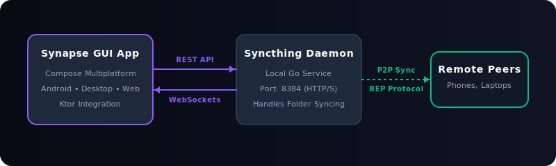

<!-- Hero Banner -->
<p align="center">
  
</p>

<p align="center">
  <strong>A premium, modern, cross-platform Compose Multiplatform client for Syncthing.</strong>
</p>

<p align="center">
  <a href="#running-the-apps">Get Started</a> •
  <a href="#architecture--workflow">Architecture</a> •
  <a href="#project-structure">Project Structure</a> •
  <a href="#web-deployment-constraints">Web Deployment Constraints</a>
</p>

---

**Synapse** is a unified dashboard and user interface for managing [Syncthing](https://syncthing.net/) file synchronization states. Built using Kotlin Multiplatform and Jetpack Compose, it brings a consistent, native, and premium Material 3 experience to Android, iOS, Desktop (JVM), and Web browsers.

---

### 🖥️ Architecture & Workflow

<p align="center">
  
</p>

* **Synapse GUI:** Communicates with the daemon REST API and opens WebSockets to receive instant, real-time sync state updates.
* **Syncthing Daemon:** Runs in the background, handling the low-level block index exchanges and peer-to-peer file transfer protocols (BEP).

---

### ✨ Features

* **Sleek Material 3 Theme:** Dynamic styling supporting system dark and light modes, customized status colors (emerald green for connected, amber for paused, crimson for disconnected).
* **Tray Integration (Desktop):** Minimize to system tray on Windows/macOS with background memory optimization and instant desktop notifications.
* **Auto-Start on Boot:** Support for automatic startup registration on Windows target.
* **Wasm & JS Web Targets:** High-performance Kotlin/Wasm web client alongside standard JS fallback.

---

### 📁 Project Structure

* **[`/app/shared`](./app/shared/src)**: The core UI and business logic shared across all platforms using Compose Multiplatform.
  * **[`commonMain`](./app/shared/src/commonMain/kotlin)**: Shared layouts, controllers, and resources.
  * **`androidMain`**, **`iosMain`**, **`jvmMain`**: Target-specific hooks for native APIs.
* **[`/app/androidApp`](./app/androidApp)**: Native entry point and services for the Android application.
* **[`/app/desktopApp`](./app/desktopApp)**: Entry point for the JVM Desktop target, system tray configurations, and native Windows bindings.
* **[`/app/webApp`](./app/webApp)**: Builds the WASM and JS browser packages.
* **[`/core`](./core/src)**: Shared networking, configuration databases, and utility logic.
* **[`/server`](./server/src/main/kotlin)**: Built-in Ktor API server.

---

### 🚀 Running the Apps

You can run these configurations directly from Android Studio / IntelliJ IDEA's run widget, or run them from the terminal:

#### 📱 Mobile Targets
* **Android App:**
  ```bash
  ./gradlew :app:androidApp:assembleDebug
  ```
* **iOS App:** Open the [`/app/iosApp`](./app/iosApp) folder in Xcode and build/run.

#### 💻 Desktop Target
* **Development (Hot Reload):**
  ```bash
  ./gradlew :app:desktopApp:hotRun --auto
  ```
* **Standard Execution:**
  ```bash
  ./gradlew :app:desktopApp:run
  ```

#### 🌐 Web Target
* **Modern Web (WasmJs - Faster):**
  ```bash
  ./gradlew :app:webApp:wasmJsBrowserDevelopmentRun
  ```
* **Legacy Web (JS):**
  ```bash
  ./gradlew :app:webApp:jsBrowserDevelopmentRun
  ```

#### 🔌 Backend Server
* **Ktor Server:**
  ```bash
  ./gradlew :server:run
  ```

---

### 🧪 Running Tests

Run tests inside your IDE gutter or run them from the command line:

* **Android:** `./gradlew :app:shared:testAndroidHostTest`
* **Desktop:** `./gradlew :app:shared:jvmTest`
* **Web (Wasm):** `./gradlew :app:shared:wasmJsTest`
* **Web (JS):** `./gradlew :app:shared:jsTest`
* **iOS:** `./gradlew :app:shared:iosSimulatorArm64Test`
* **Server:** `./gradlew :server:test`

---

### ⚠️ Web Deployment Constraints

When compiling or deploying the Web (WasmJs/JS) targets, browsers enforce strict security rules that affect communication with Syncthing:

> [!WARNING]
> **CORS (Cross-Origin Resource Sharing)**
> By default, the Syncthing daemon does not send CORS headers. This prevents browser applications hosted on a different origin (e.g., Synapse on `http://localhost:8080`) from making REST calls to the daemon.
> 
> * **Workaround:** Configure Syncthing to include CORS headers, run the Synapse Web App as a browser extension with host permissions, or serve both the Synapse assets and the daemon through a reverse proxy.

> [!IMPORTANT]
> **Mixed-Content Restrictions**
> Modern web browsers block insecure HTTP requests (like local Syncthing on `http://127.0.0.1:8384`) from sites served securely over HTTPS.
> 
> * **Workaround:** If hosting Synapse on a secure HTTPS server, you must configure Syncthing to use HTTPS (and ensure you accept its certificate in your browser).